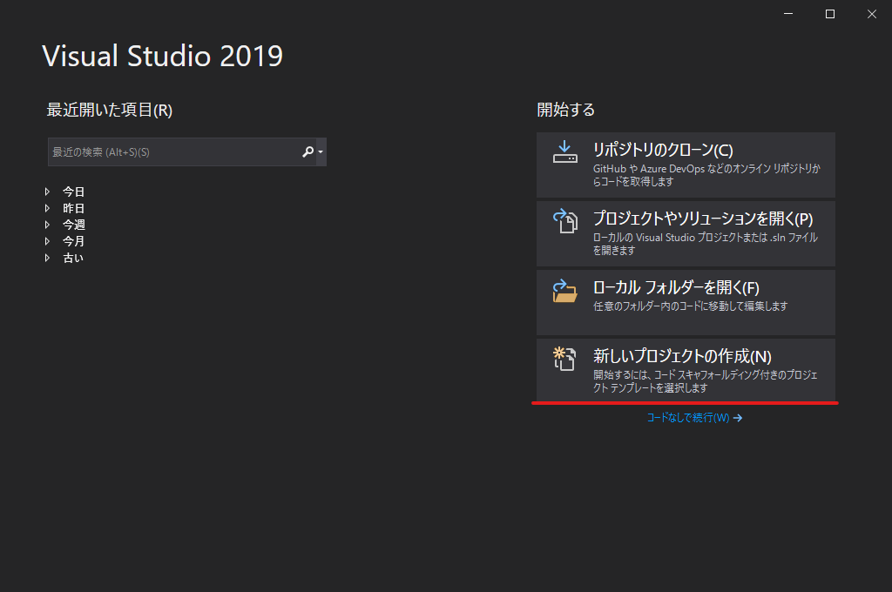
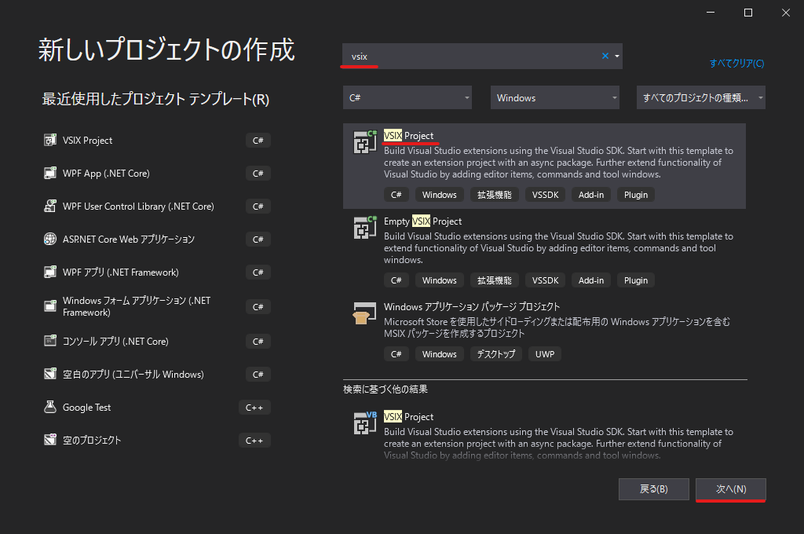
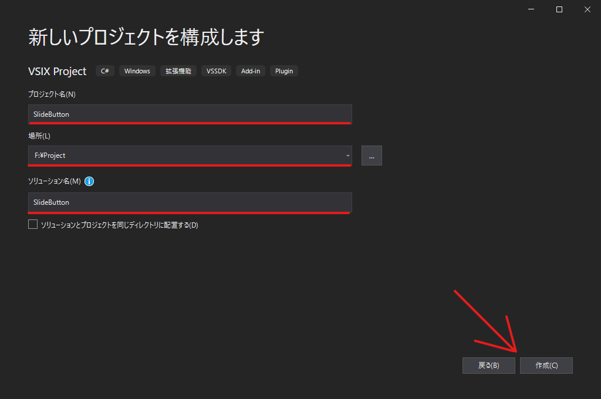
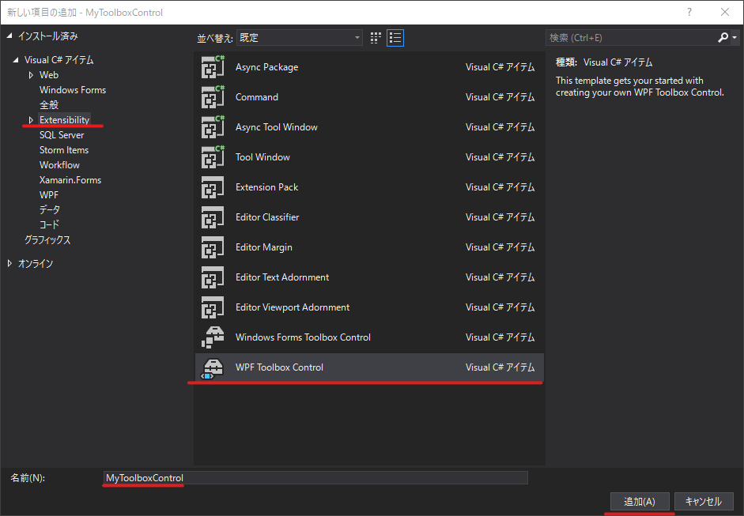

# ツールボックスコントロールの作り方

## Toolbox Controlを作る
### 拡張WPF Toolbox Controlを作る
1.  VSIXプロジェクトを作成する．  
    新規プロジェクト作成 > 検索ボックスに「vsix」と入力すればよい．  
    
    
    

1.  プロジェクトが開いたら ___WPF Toolbox Control___ を追加する．  
    1. プロジェクトを ___右クリック___ > ___追加___ > ___新しい項目___
    1. ダイアログが表示されたら  ___Extensibility___ > ___WPF Toolbox Control___
    

    　これでこのソリューションにはユーザコントロールをツールボックスに追加するための ___ProvideToolboxControlAttribute  
    [RegistrationAttribute](https://docs.microsoft.com/ja-jp/dotnet/api/microsoft.visualstudio.shell.registrationattribute?view=visualstudiosdk-2019)___ と，VSIXマニュフェストの ___Microsoft.VisualStudio.ToolboxControl___ が含まれるようになりました．

    これでこのソリューションには以下のものができました．
    
    |項目|説明|
    |---|---|
    |ユーザコントロール|ユーザコントロールの雛形|
    |ProvideToolboxControlAttribute [RegistrationAttribute](https://docs.microsoft.com/ja-jp/dotnet/api/microsoft.visualstudio.shell.registrationattribute?view=visualstudiosdk-2019)|ユーザコントロールをツールボックスに追加するためのもの|
    |Microsoft.VisualStudio.ToolboxControlアセットエントリ|開発のためのVSIXマニュフェスト|

# 参考
英語じゃないとわけわかんない．  
[Microsoft MSDN - Create a WPF Toolbox Control](https://docs.microsoft.com/ja-jp/visualstudio/extensibility/creating-a-wpf-toolbox-control?view=vs-2019)