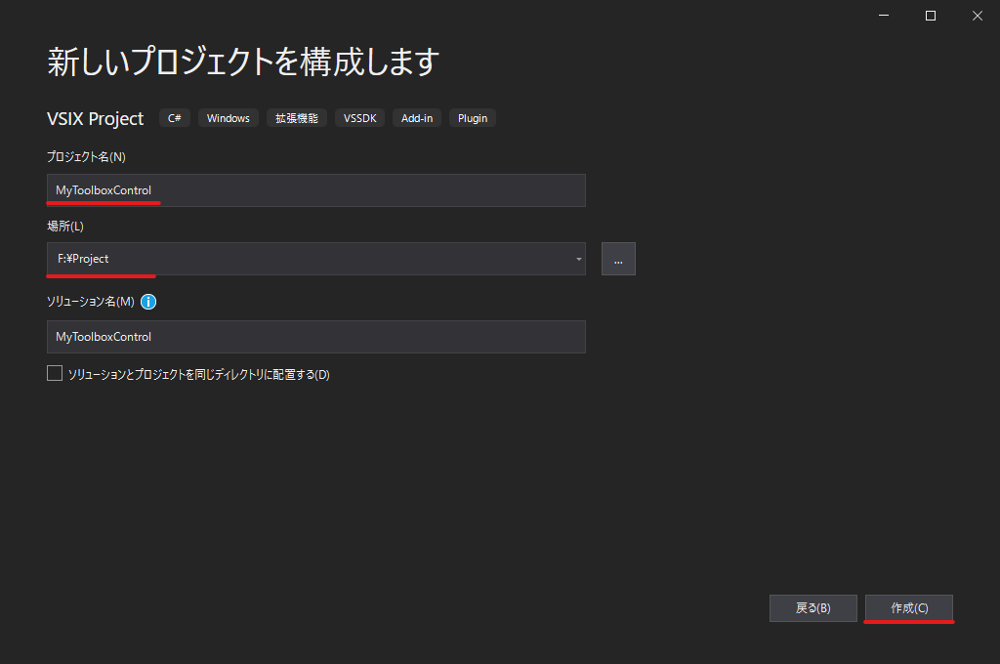

# ツールボックスコントロールの作り方

## Toolbox Controlを作る
### 拡張WPF Toolbox Controlを作る
1.  VSIXプロジェクトを作成する．  
    新規プロジェクト作成 > 検索ボックスに「vsix」と入力すればよい．  
    
    
    

1.  プロジェクトが開いたら ___WPF Toolbox Control___ を追加する．  
    1. プロジェクトを ___右クリック___ > ___追加___ > ___新しい項目___
    1. ダイアログが表示されたら  ___Extensibility___ > ___WPF Toolbox Control___
    

    これでこのソリューションには以下のものができた．
    
    |項目|説明|
    |---|---|
    |ユーザコントロール|ユーザコントロールの雛形|
    |ProvideToolboxControlAttribute [RegistrationAttribute](https://docs.microsoft.com/ja-jp/dotnet/api/microsoft.visualstudio.shell.registrationattribute?view=visualstudiosdk-2019)|ユーザコントロールをツールボックスに追加するためのもの|
    |Microsoft.VisualStudio.ToolboxControlアセットエントリ|開発のためのVSIXマニュフェスト|

### コントロールUIを作る
1.  __MyToolboxControl.xaml__ をデザイナーで開く．  
    デザイナーでは [__Grid__](https://docs.microsoft.com/ja-jp/dotnet/api/system.windows.controls.grid?view=netcore-3.1) コントロールと， [__Button__](https://docs.microsoft.com/ja-jp/dotnet/api/system.windows.controls.button?view=netcore-3.1) コントロールが表示されている．

    

1.  Gridレイアウトを配置する（Visual Studio 2019だとすでに配置されている）．  
    Gridに行を追加するときは上端のコントロールバーをクリックする．  
    列を追加するときは左端のコントロールバーをクリックする．  

1.  Gridにコントロールを追加する．  
    ツールボックスからD&D，Xamlの編集でコントロールを追加できる．

    - コーディング例  
    Gridを2行に分け，1行目を2列に分けた状態．  
    1行目にはラベルを左右に配置し，2行目にはボタンを配置している．

    ```xaml
    <Grid>
        <Grid.ColumnDefinitions>
            <ColumnDefinition/>
            <ColumnDefinition/>
        </Grid.ColumnDefinitions>
        <Grid.RowDefinitions>
            <RowDefinition/>
            <RowDefinition/>
        </Grid.RowDefinitions>
        <Label Name="label1" Content="Label1" Grid.Row="0" Grid.Column="0"/>
        <Label Name="label2" Content="Label2" Grid.Row="0" Grid.Column="1"/>
        <Button Name="Button1" Content="Push Me!!" Click="button1_Click" Grid.Row="1" Grid.ColumnSpan="2" />
    </Grid>
    ```
    

### コントロールの名前を変更する
このままだと，ツールボックスに追加したときに __MyToolboxControl.MyToolboxControl__ 名前空間の __MyToolboxControl__ として表示されてまう．  
それを回避するために， __MyToolboxControl.xaml.cs__ ファイルで名前を変更する．

1.  __MyToolboxControl.xaml.cs__ のコードを表示する．
1. クラス名を任意の名前に変更する．

# 参考
英語じゃないとわけわかんない．  
[Microsoft MSDN - Create a WPF Toolbox Control](https://docs.microsoft.com/ja-jp/visualstudio/extensibility/creating-a-wpf-toolbox-control?view=vs-2019)